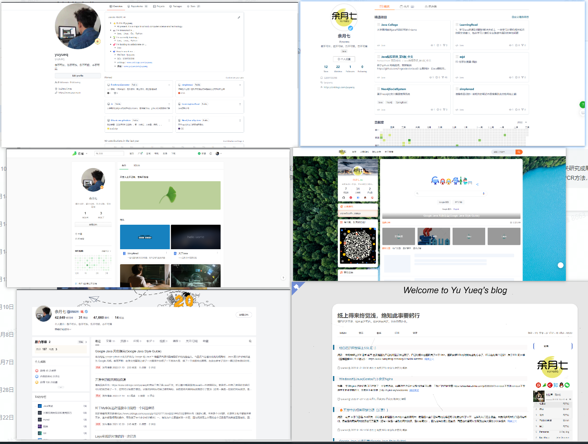

<h1 style="text-align:center">开始阅读Yuyueq</h1>

  
  
  
  
  
  <!--  -->

**更新记录**
>2022/3/16   16：24   优化内容（去除掉进入首页，博客园部分文章导入并进行排版优化，新增"资源"、“语雀”两个模块）
> 
>2022/3/15   11：11   更新整个结构
> 
>2021/11/10  16：30   初始化仓库

> **关于我的一些社交平台，其实将近百分之九十的内容都是一样的，毕竟刚开始使用的博客园去记录的**

## Introduction

笔名：余月七

毕业于一所普通的二本院校

---

## 资源

### 开发
[🔥🔥🔥开发中的相关网站资源（长更！）](docs/bokeyuan/2022/🔥开发中的相关网站资源（长更！）.md)

[程序员崩溃的40个瞬间（跳转语雀)](https://www.yuque.com/yuyueq/simpread/1643264312574)

[Java开发手册阿里（跳转语雀)](https://www.yuque.com/yuyueq/java/awf3ga)

[layuiAdminPro单页版开发者文档](docs/docResource/layuiAdminPro单页版开发者文档.md)

### 日常
[🔥🔥🔥我常用的网站资源集合（长更！）](docs/bokeyuan/2021/🔥我常用的网站资源集合（长更！）.md)

[应届生扫盲，求职必看！三方协议&签约违约你必须了解的事](docs/docResource/应届生扫盲，求职必看！三方协议&签约违约你必须了解的事.md)

---

## 博客园

### 2020年
[初学编程所看的书籍](docs/bokeyuan/2020/初学编程所看的书籍.md)

[Linux目录，rpm及top，vi命令简记](docs/bokeyuan/2020/Linux目录，rpm及top，vi命令简记.md)

[Linux系统中有趣的命令（可以玩小游戏）](docs/bokeyuan/2020/Linux系统中有趣的命令（可以玩小游戏）.md)

[Windows下的Linux子系统](docs/bokeyuan/2020/Windows下的Linux子系统.md)

[修改RedHat7的root用户密码](docs/bokeyuan/2020/修改RedHat7的root用户密码.md)

[Centos7或RedHat7下安装Mysql](docs/bokeyuan/2020/Centos7或RedHat7下安装Mysql.md)

[记Centos7和RHEL连接不上网络](docs/bokeyuan/2021/记Centos7和RHEL连接不上网络.md)

[Eclipse工具的简单使用](docs/bokeyuan/2020/Eclipse工具的简单使用.md)

[认识JDBC](docs/bokeyuan/2020/认识JDBC.md)

[如何（正确）使用搜索引擎？使用搜索引擎的高效技巧（例如：百度、谷歌）](docs/bokeyuan/2020/如何（正确）使用搜索引擎？使用搜索引擎的高效技巧（例如：百度、谷歌）.md)

[安装VMTools失败的三类解决方法（Windows、Linux、MacOs）](docs/bokeyuan/2020/安装VMTools失败的三类解决方法（Windows、Linux、MacOs）.md)

[如何更换Windows中命令行字体](docs/bokeyuan/2020/如何更换Windows中命令行字体.md)

[Host是什么？如何设置host文件？](docs/bokeyuan/2020/Host是什么？如何设置host文件？.md)

[让电脑变好用的几款软件和工具(肝货三)](docs/bokeyuan/2020/让电脑变好用的几款软件和工具(肝货三).md)

[简单的电脑使用和维护方法（肝货一）](docs/bokeyuan/2020/简单的电脑使用和维护方法（肝货一）.md)

[简单的电脑使用技巧和维护方法（肝货二）](docs/bokeyuan/2020/简单的电脑使用技巧和维护方法（肝货二）.md)

### 2021年
[2021.11-12月SQL、前端、Java文章学习及资源记录](docs/bokeyuan/2021/2021.11-12月SQL、前端、Java文章学习及资源记录.md)

[对于MySQL远程连接中出现的一个问题总结](docs/bokeyuan/2021/对于MySQL远程连接中出现的一个问题总结.md)

[对HashMap的一次记录](docs/bokeyuan/2021/对HashMap的一次记录.md)

[面试问题记录三(JavaWeb、JavaEE)](docs/bokeyuan/2021/面试问题记录三(JavaWeb、JavaEE).md)

[面试问题记录二(数据库、Linux、Redis)](docs/bokeyuan/2021/面试问题记录二(数据库、Linux、Redis).md)

[面试问题记录一(基础部分)](docs/bokeyuan/2021/面试问题记录一(基础部分).md)

[WEB与游戏开发的一些区别-web与游戏开发的一些区别](docs/bokeyuan/2021/WEB与游戏开发的一些区别-web与游戏开发的一些区别.md)

[MarkDown常用语法全纪录](docs/bokeyuan/2021/MarkDown常用语法全纪录.md)

[Ubuntu18.04的下载与安装（全过程纪录）](docs/bokeyuan/2021/Ubuntu18.04的下载与安装（全过程纪录）.md)

### 2022年
[给自己的网站装上SSL证书](docs/bokeyuan/2022/给自己的网站装上SSL证书.md)

[Windows和Linux(Centos7)下安装Nginx](docs/bokeyuan/2022/Windows和Linux(Centos7)下安装Nginx.md)

[Google Java风格指南](docs/bokeyuan/2022/GoogleJava风格指南.md)

---

## 语雀
### Introduction
会把语雀平时记录的东西搬过来，当做公开笔记

[MySQL实战45讲](docs/yuque/MySQL实战45讲.md)

[趣谈网络协议](docs/docResource/趣谈网络协议.md)

