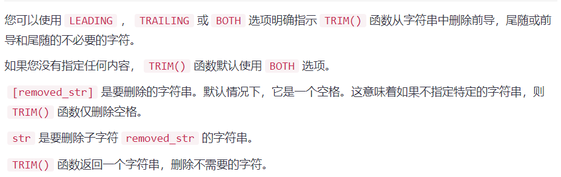

# 前言
> 上次在年前快要放假的时候记录的一篇安装SSL证书的内容，因为当时公司开始居家办公了，我也打算回个家
> 毕竟自己在苏州这半年一个人也是很想家的，所以就打算年过完来重新写博客。不巧的是，当时我2月中旬刚到苏州，
> 没想到苏州疫情爆发了，直接隔离十四天，自己平时就完成公司的开发任务以及自己的毕设，把写博客的事有点淡忘了，
> 最近也算自己手头的一些事都开始可以顺利进行了，想起也是时候去记录一下了。
> 很多新学的东西自己感觉就是入了个门，所以平时基本就直接放语雀上了，这次也是打算做一个简短的总结吧！

> 
> 

# SQL函数
## 字符串函数
### FIND_IN_SET(param1，param2)
这是一个字符串相关的函数

**FIND_IN_SET(needle,haystack)**里面有两个参数，我们可以简单的看作find_in_set(param1,param2)

**第一个参数param1**：它是我们要查找的某一个具体的值

**第二个参数param2**：它是我们要查找的字符串列表

+ 当param2在param2这个列表中的话，函数返回一个正整数
+ 当param1不在param2中，或者param2这个列表是个NULL，函数返回0
+ 当两个参数param1或param2为NUll的时候，函数放回NULL

这里以LEFT JOIN举个“栗”子：

**LEFT JOIN**：说的简单点就是，左表记录会全部返回，同时如果与右表有记录相等的数据会返回右表的一些相关信息，如果没有，右表返回的记录就是NULL
（这个可以去参考CSDN此篇博客：[Sql之left join（左关联）、right join（右关联）、inner join（自关联）的区别
](https://blog.csdn.net/hj7jay/article/details/51749863)

```
这里假设有a和b两张表，a表中的id是个bigint类型，b表中的relate_a_id是个varchar类型，存放的是关联的a表中的id
（这里仅仅是举个栗子，表的设计一定要符合规范，比如这种关联的可以新增一张关联表的操作）
select a.id,
       a.name,
       IFNULL(b.id,0) AS flag,
       b.relate_a_id
       from a left join b on FIND_IN_SET(a.id,relate_a_id) and a.id = b.id
       
这样如果a.id在这个b表中relate_a_id这个字段的列表中的话就返回b.id，如果不在就放回0。这里起了个别名为flag作为判断量

```

单表的操作更简单，总而言之，这个函数就是为了判断一个值是否在一个字符串列表中的操作。

同理和NULL、NOT NULL一样，如果要判断不在当中就直接NOT FIND_IN_SET()就可以了

**这里要提一点的就是，以上操作看起来和IN这个操作符很像，所以这里我的理解是**：

```
虽然
1 IN(1,2,3)  和  FIND_IN_SET(1,"1,2,3")  最终的结果是一样的，但是如下：
IN它是“值”对“值”，而FIND_IN_SET(param1，param2)是“值”对“一个列表”，而且FIND_IN_SET这个函数有自己的固定的两个参数
+ 不同点一：比较内容不同
+ 不同点二：函数格式不同

以上也是自己的一些浅见，如有错误，请各位大佬虚心赐教！
```

###其他
字符串函数其实还有很多比较常见的，比如：
### CONCAT(param1,param2,……)
这个函数里面也是有参数的，就是把两个或多个参数组合到一起的函数，当然还有CONCAT_WS(seperator,param1,param2,……)
根据第一个参数“分隔符”，来组合参数列表。

```
对于这个函数比较熟悉的就是写动态SQL的时候与LIKE操作符的应用，比如：
select a.name from a where a.is_delete =0
<if test="param.serachName!=''">
    and a.name like concat('%',#{param.serachName},'%')
</if>

这也是为了单纯写like去传参数的话，会出现SQL注入的风险，所以采用这种方式来防止SQL注入
```

### REPLACE(str,oldStr,newStr)
这里要注意的是mysql扩展中REPLACE是个插入更新语句，但它没有where字句，具体可以自行搜索查看
```
举个例子：
REPLACE('aaa.yuyueq.cn'，'a'，'w')
结果为：www.yuyueq.cn
```

### SUBSTRING(str,index)
它会从一个特定长度的位置开始，提取一个子字符串。
```
也可以写为SUBSTRING(str FROM index),举个例子：
SUBSTRING('www.yuyueq.cn',5)
结果为：'yuyueq.cn'
要注意的是它不在遵循计算机的规律，也就是它是从1开始数的，并不是0，如果index参数是0.则返回一个空字符串
```
当然也可以截取字符串中字符串，比如
```
(substring(str,index,length)和下面这个是一样的)
SUBSTRING(str FROM index FROM length),举个例子：
SUBSTRING('www.yuyueq.cn',5,6)
结果为：'yuyueq'
```

### TRIM([{BOTH|LEADING|TRAILING} [removed_str]] FROM str)
是从字符串中删除不需要的字符


trim操作个人感觉多用于动态SQL中吧，可以看看简书的这篇：[mybatis动态SQL - trim where set标签](https://www.jianshu.com/p/d27f60937da9)

### FORMAT(N,D,locale)
格式化具有特定区域设置的数字，舍入到小数位数。
N是要格式化的数字。
D是要舍入的小数位数。
locale是一个可选参数，用于确定千个分隔符和分隔符之间的分组。如果省略locale操作符，MySQL将默认使用en_US。以下链接提供MySQL支持的所有区域名称：

### LEFT()
获取指定长度的字符串的左边部分。
### LENGTH()函数&CHAR_LENGTH()
它是以字节和字符获取字符串的长度。

---

## 聚合函数
### COUNT()
首先官方已经说了,count(*)和count(1)没有区别
> InnoDB handles SELECT COUNT(*) and SELECT COUNT(1) operations in the same way. There is no performance difference.

其次，count(字段)和count(*)、count(1)的区别是：
+ count(字段)会进行全表扫描，效率会很差，不计算NULL值
+ count(*)、count(1)会计算NULL值，而且count(*)等同于count(0)

### 四个计算
AVG()：取平均值

SUM()：求和

min()：最小值

max()：最大值

### GROUP_CONCAT()


# SQL优化

上面的内容其实也设计到了很多规范的问题，但毕竟我是为了举例子所以在这提一些规范的操作。


